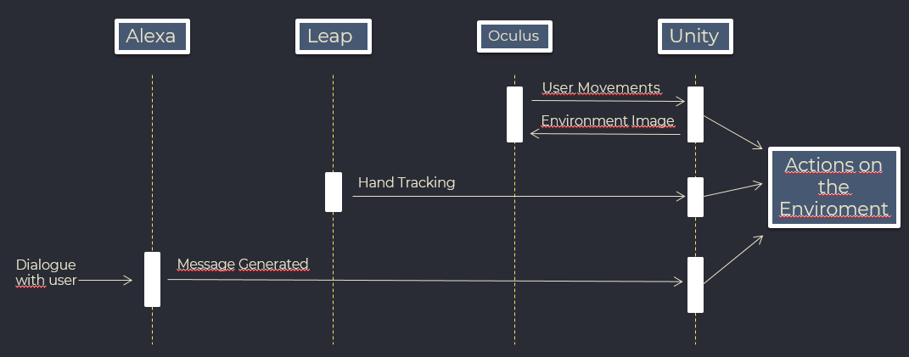
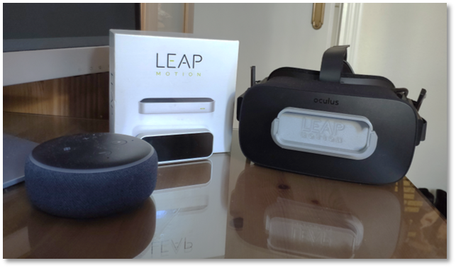
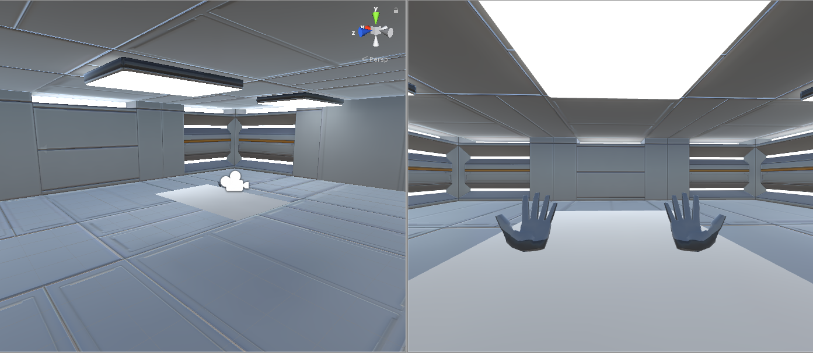
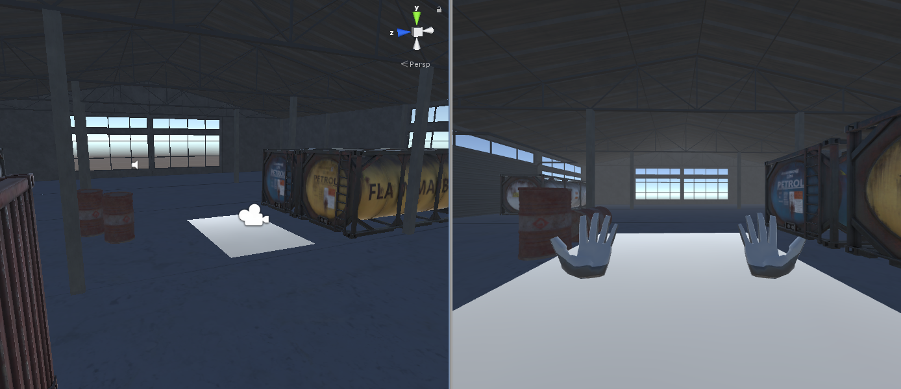
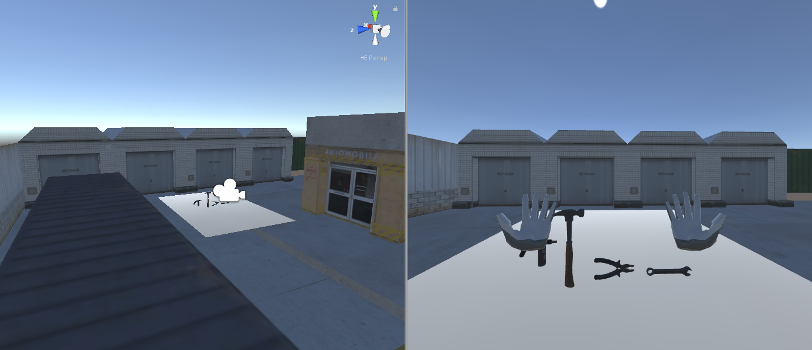
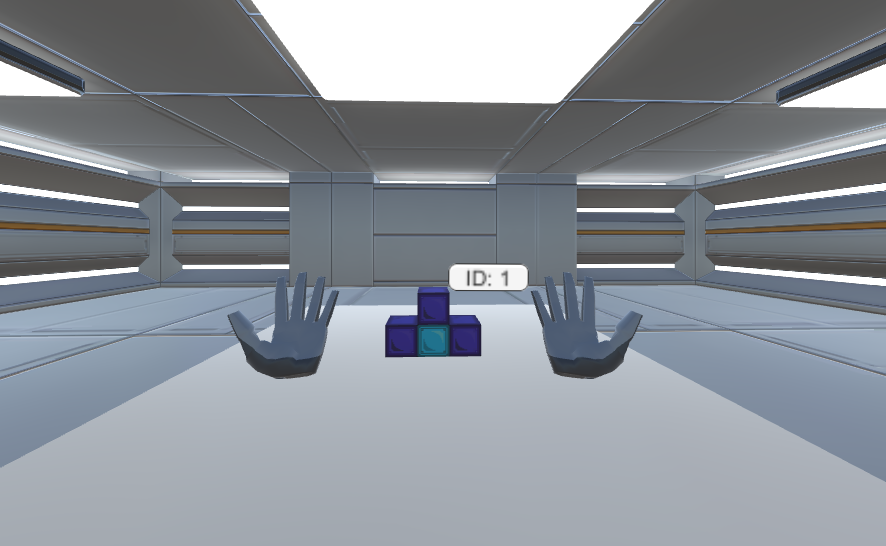
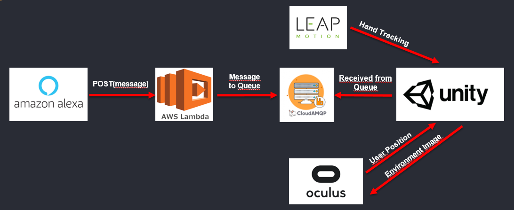

# **Development of Virtual Environments for Didactics Purposes in Companies**

### This work was made as a **Final Degree Project** of **Computer Engineering Sciences** at **Escuela Superior de Ingeniería (UCA).** - 2021

## **Demonstration**

https://user-images.githubusercontent.com/33625416/130407194-be3cf021-078f-4ef7-af3f-bcbead383aa4.mp4

## **Abstract**

Due to the growth of technology, human being is capable of interacting with a virtual system in many differents ways, either with our own hands as in the case of the device **Leap Motion**, with our voice (**Alexa**, **Amazon's Echo Dot**), etc. We can even visualize an environment as if we were there with the virtual reality headset **Oculus Rift**. 

Therefore, a lot of companies have taken the opportunity to integrate their products and create applications oriented to education, simulations or practice using the technologies simultaneously and together.

This work will deepen in this topic because our intention is to create an environment prototype that will integrate all these technologies and that it can be used in the future for didactic tasks in companies.

## **Components**

* **Alexa Device** (in this case I used **Amazon Echo Dot**)
* **Leap Motion**
* **Leap Motion VR Adapter**
* **Oculus Rift CV1**

## **Software**

* **Unity**
* **AWS Lambda**
* **CloudAMQP**
* **Alexa Skill Kit**

 

## **Interaction Diagram**

<figure>
  
  <figcaption> </figcaption>
</figure>

 

## **Development**
 

### **Virtual Environment**

The initial idea of the project was to made a prototype of virtual environment so workers from companies can learn in an efficient way how to carry out some processes. To make our virtual environment very efficient and intuitive we will use some technologies that will allow the user to make certain actions without effort.

These technologies are:

* Alexa &rarr; **Voice Assistant**
* Oculus Rift CV1 &rarr; **VR Headset**
* Leap Motion &rarr; **Hands Tracker** 

<figure>
  
  <figcaption> </figcaption>
</figure>

With **Alexa** the user will be capable of creating things or starting simulations through voice commands. VR Headset **Oculus Rift** will allow the user to see the environment from a realistic perspective and even move in it. Finally, **Leap Motion** captures the position of the hand (and fingers) and let the users interact with the objects from our virtual environment without a physical controller.

First of all I created a **Unity project** where I inserted the **Oculus** and **Leap Motion** *assets* and I designed a a pleasant background and 2 industrial background so the user could feel more comfortable or even more inmmersed in the industrial simulations. The objects and materials for the backgrounds were extracted of *free assets*.

 
&nbsp; Asset source: Creepy Cat - 3D Scifi Kit Starter Kit 3D model 2020
<figure>
  
  <figcaption> </figcaption>
</figure>

 

 
&nbsp; Asset source: MesnikAnd - Modular warehouse Free low-poly 3D model 2020
<figure>
  
  <figcaption> </figcaption>
</figure>

 

&nbsp; Asset source: OnkarShevkar - Low Poly Buildings Free low-poly 3D model 2017
<figure>
  
  <figcaption> </figcaption>
</figure>

 

Next I created some objects based on **tetris blocks**. These objects have physics (*gravity, collisions...*) and have interactions with our own hands thanks to the **Leap Motion**.

<figure>
  
  <figcaption> </figcaption>
</figure>

 

### **Alexa Infraestructure**

Once the Virtual Environment was setted, I created an infraestructure where the user can modify the environment through Alexa. To make this I used my own skill for this project (**Objetos V. R.**)

<figure>
  
  <figcaption> </figcaption>
</figure>

