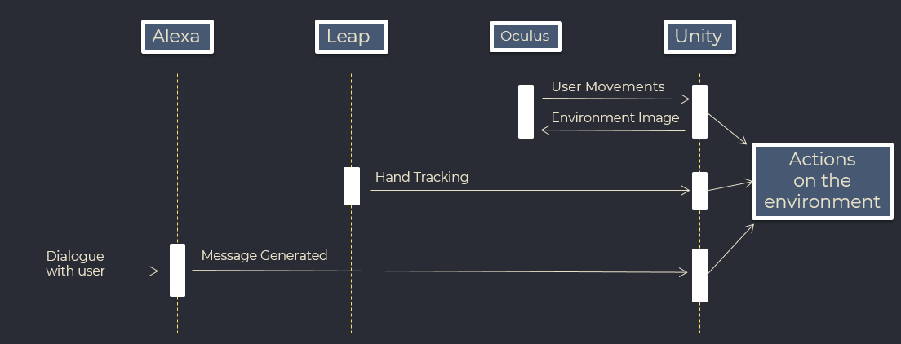
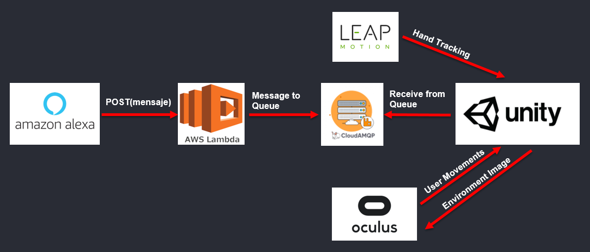

# **Development of Virtual Environments for Didactics Purposes in Companies**

### This work was made as a **Final Degree Project** of **Computer Engineering Sciences** at **Escuela Superior de Ingeniería (UCA).** - 2021

## **Demonstration**

https://user-images.githubusercontent.com/33625416/130407194-be3cf021-078f-4ef7-af3f-bcbead383aa4.mp4

## **Abstract**

Due to the growth of technology, human being is capable of interacting with a virtual system in many differents ways, either with our own hands as in the case of the device **Leap Motion**, with our voice (**Alexa**, **Amazon's Echo Dot**), etc. We can even visualize an environment as if we were there with the virtual reality headset **Oculus Rift**. 

Therefore, a lot of companies have taken the opportunity to integrate their products and create applications oriented to education, simulations or practice using the technologies simultaneously and together.

This work will deepen in this topic because our intention is to create an environment prototype that will integrate all these technologies and that it can be used in the future for didactic tasks in companies.

## **Components**

* **Alexa Device** (in this case I used **Amazon Echo Dot**)
* **Leap Motion**
* **Leap Motion VR Adapter**
* **Oculus Rift CV1**

## **Software**

* **Unity**
* **AWS Lambda**
* **CloudAMQP**
* **Alexa Skill Kit**

 

## **Interaction Diagram**

<figure>
  
  <figcaption> </figcaption>
</figure>

 

## **Development**
 

### **Virtual Environment**

The initial idea of the project was to made a prototype of virtual environment so workers from companies can learn in an efficient way how to carry out some processes. To make our virtual environment very efficient and intuitive we will use some technologies that will allow the user to make certain actions without effort.

These technologies are:

* Alexa &rarr; **Voice Assistant**
* Oculus Rift CV1 &rarr; **VR Headset**
* Leap Motion &rarr; **Hands Tracker** 

<figure>
  
  <figcaption> </figcaption>
</figure>

With **Alexa** the user will be capable of creating things or starting simulations through voice commands. VR Headset **Oculus Rift** will allow the user to see the environment from a realistic perspective and even move in it. Finally, **Leap Motion** captures the position of the hand (and fingers) and let the users interact with the objects from our virtual environment without a physical controller.

First of all I created a **Unity project** where I inserted the **Oculus** and **Leap Motion** *assets* and I designed a a pleasant background and 2 industrial background so the user could feel more comfortable or even more inmmersed in the industrial simulations. The objects and materials for the backgrounds were extracted of *free assets*.

 
&nbsp; Asset source: Creepy Cat - 3D Scifi Kit Starter Kit 3D model 2020
<figure>
  
  <figcaption> </figcaption>
</figure>

 

 
&nbsp; Asset source: MesnikAnd - Modular warehouse Free low-poly 3D model 2020
<figure>
  
  <figcaption> </figcaption>
</figure>

 

&nbsp; Asset source: OnkarShevkar - Low Poly Buildings Free low-poly 3D model 2017
<figure>
  
  <figcaption> </figcaption>
</figure>

 

Next I created some objects based on **tetris blocks**. These objects have physics (*gravity, collisions...*) and have interactions with our own hands thanks to the **Leap Motion**.

<figure>
  
  <figcaption> </figcaption>
</figure>

 

### **Infraestructure**

Once the Virtual Environment was setted, I had to create an infraestructure where the user can modify the environment through Alexa. To make this I made my own **alexa skill** for this project (**Objetos V. R.**) and create a **queue** in the cloud (using **CloudAMQP**) where the messages will be stored.

<figure>
  
  <figcaption> </figcaption>
</figure>

So as we see in the last figure, this infraestructure consists in some technologies:

1.  **Alexa:** creates a message which sums up the action that the user asked in their dialogue and sends it by a POST method to an **AWS Lambda Function**.
2.  **AWS Lambda:** this technology is implemented in our infraestructure because we use a non-native library called **amqplib** to uploads messages in the queue and Alexa only allows default libraries for Javascript, so we had to figure out another way to send our message to the queue. The solution was creating an AWS Lambda function which keeps listening (API Rest structure) and when receive a message (by a POST operation from Alexa) will execute the code from amqplib and put the message in the queue.
3.  **CloudAMQP:** stores the messages in the cloud waiting for our environment to receive them. 
4.  **Unity:** receives the messages using a library similar to **amqplib** for C#. Next, depending on the message a specific action will be done on the environment. We use CloudAMQP for storing messages because it uses the **Message Queue method** which allows us to receive messages without spending a lot of resources from our environment. Apart from receiving messages and doing actions, Unity also interacts with both Oculus Rift headset and Leap Motion simultaneously.

### **Alexa Skill**

The **Alexa skill** we created for this project is called **Objetos V.R.** and was developed with *Javascript*. This skill has a few actions availables:

1. **Create a block:** creates a block in the environment with the color the user provided
2. **Remove a block:** every block we create by the last method contains an ID, so the user can provide that ID to refer to the block and remove it
3. **Change the environment:** changes the background of the project with the 3 mentioned before 
4. **Simulations:** as we said, the main purpose of this project is to teach employees on a certain process of a company, so every simulation we introduce can lead the user to learn how to do a process properly. We will deepen in every simulation in the next section.
5. **Object Generation:** the user provides the name of an object and our environment searches for it in a 3D model collection on the internet. If the object is available it will be introduced on the environment. We will deepen in this method in the next sections.

For development purposes the skill is not available to download. This is because every person that had used this skill could have made actions on our environment.

### **Simulations**

TicTacToe with Artificial Intelligence as the opponent. The goal is to demonstrate that we can integrate artificial intelligent models into these environments to teach correctly to workers.

### **Object Generation**

In the object generation, we ask for a certain thing (in the image we ask for 'cat'), then we connect to the API of a 3D models database and search for a model with greatest reviews. We download it and once is loaded in the environment, we can select its size with the bar and button we have at the right bottom. Finally, when we select the desired size, push the green button on the left and we can interact with the object.

### LICENSE

MIT License - Copyright (c) 2021 [Rafa Román](https://github.com/rafaroman18)
